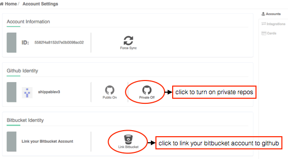

page_title: Shippable Account Settings
page_description: Account Settings, Integratons, Account Tokens, Credit Cards
page_keywords: containers, lxc, docker, Continuous Integration, Continuous Deployment, CI/CD, testing, automation, Tokens, account settings

# Account Settings

This page will explain the different options available in the Account Settings Page.

## How do you get here?

- Login to [Shippable](http://shippable.com)
- Click on Account Settings icon on the top nav bar

      

-----------

## Account Information

**ID:** This is your account id within Shippable. This is the id that is linked to any access tokens you create or credit cards you add to your account.

**Force Sync:** We periodically sync account info with GitHub and Bitbucket. Use this button to sync your account if you would like to see any changes made upstream immediately. Example: You have been added to a new subscription as an owner/collaborator; you have new repos in github and want to see it immediately; you linked your bitbucket account to this account and want to see your bitbucket repositories right away.

## GitHub Identity

If you are using a GitHub Account to log in, this displays the GitHub user settings.

**Public On:** This indicates that we have access to your Public Repos in GitHub. This is turned on by default, since signing into Shippable requires you to authorize this access on GitHub.

**Private On/Off:** This indicates whether Shippable has access to your Private Repos. This is a **one-way** toggle button. This needs to be turned on for Shippable to run any builds on repos that are private on GitHub. Once you turn it on, it is not possible to turn OFF access to Private repos.

If you are using a Bitbucket Account to log in, you will see an option to `Link GitHub` here. You can use this to connect both your accounts to get a consolidated view of all your projects in one Shippable Account.

Read our guide on [linking GitHub and Bitbucket Accounts](link_gh_and_bb) for more details.

## Bitbucket Identity

If you are using a Bitbucket Account to log in, this displays your bitbucket user profile and access settings.

**All Repos ON:** Bitbucket does not separate public and private repo access, so this is turned on by default when you sign in and authorize Shippable to access Bitbucket.

If you are using a GitHub Account to log in, you will see an option to `Link Bitbucket` here. You can use this to connect both your accounts to get a consolidated view of all your projects in one Shippable Account.

Read our guide on [linking GitHub and Bitbucket Accounts](link_gh_and_bb) for more details.

## Misc Settings

**Show Private Forks:** If you would like to track forks from your repo (you must be an owner of the repo), then set this to ON. This is OFF by default.

## API Tokens

This is where you generate, view and manage access tokens to use our [API](api.md).

- Click on the  to create a new token.
- Enter a name for your token
- Click `Confirm`
- Remember to copy the token. For security reasons, the token will never be displayed again.
- To delete a token, click on the _delete_ icon next to your token name

> **Note**
>
> NEVER commit code containing your API token to a public repository.
> Doing so will compromise the security of your Shippable account. Treat
> your API token like a password

*****

## Delete Account

Clicking on this will delete all account data, project data, build data and formation data from our systems.

