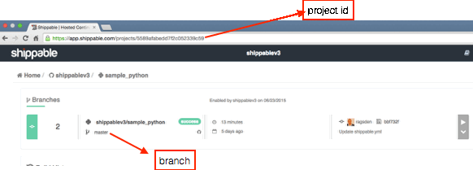

page_title: Running your first sample build
page_description: Setup up documentation for a sample build
page_keywords: getting started, build, quick start, documentation, shippable, continous integration, MT-CI

# Running a sample build
This guide walks through the process of running a sample build for **Shippable MT-CI (Multi Tenant - Continuous Integration)**

##Overview

## Sign into Shippable
- Login to [Shippable](<http://www.shippable.com>) using your source code system. The source code systems supported are GitHub, GitHub Enterprise, BitBucket and BitBucket Server
- Click the "Account Settings" icon on the top, upper right navigation bar.

- Select ‘Force Sync’ to ensure your source code system (such as GitHub, BitBucket) permissions are synced.

## Create Shippable YML
- Add the shippable.yml build configuration to your source code repo. [Instructions on creating a shippable.yml file](oe_tips.md)

## Enable a Repo

- Click on the  icon to the right of the header bar to enable a new project/repo.
- This brings you to the page with the list of projects in your repo that are yet to be enabled.
- Click on the  icon to enable the project
- If you have recently added a project to github/bitbucket and it is not showing up on the new projects list, click on the **force sync** icon to sync your source code repo with Shippable.

## Run a CI build
- Your page should look like this

- Click on the "Play" icon to trigger your CI build 

## Successful CI build
Congrats, you have successfully run your build. A sample, successful build is shown below
